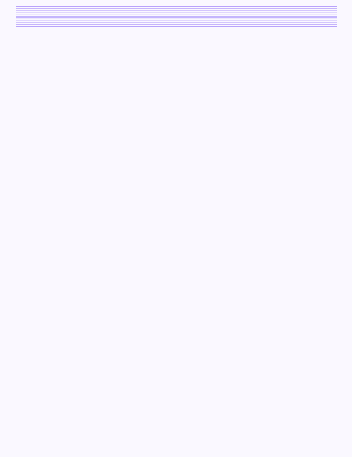

---

### 👩‍💻 About Me

- 🎓 B.Tech in AI & Data Science, Poornima College of Engineering, Jaipur (2023–2027) — CGPA 8.5/10
- 🔭 Currently exploring GenAI pipelines, RAG systems, and ML model deployment
- 💼 Interned as a **Data Science Intern @ Celebal Technologies** and **AI/ML Intern @ AssignInc Solutions**
- 📍 Based in Jaipur, Rajasthan
- 📫 Reach me: **aadrikasharma10022004@gmail.com**

---

### 🛠️ Tech Stack

---

### 🚀 Projects

- **MediChat** — RAG-based medical chatbot (LangChain, FAISS, Gemini API)
- **FinMI Graph** — Financial intelligence system using Graph RAG (Neo4j, FastAPI)
- **Deepfake Detection** — CNN/ResNet-50 classifier, 94% accuracy, published at Technovation 2024

---

### 📊 GitHub Stats

---

### 🌐 Connect

